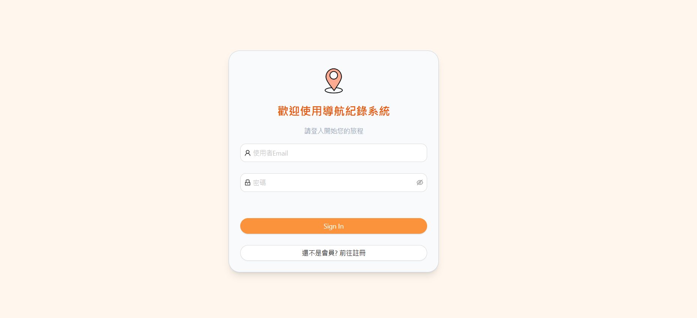
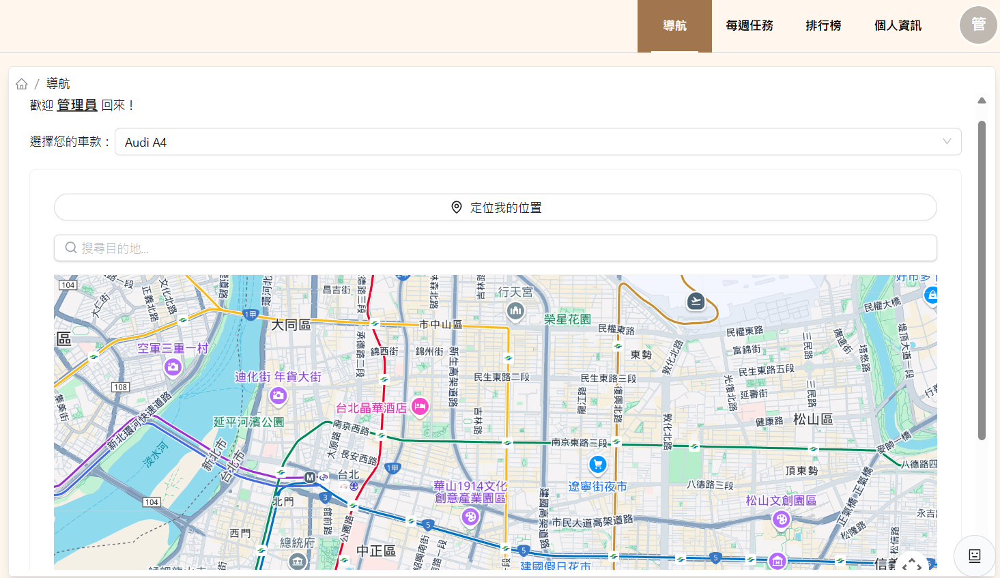
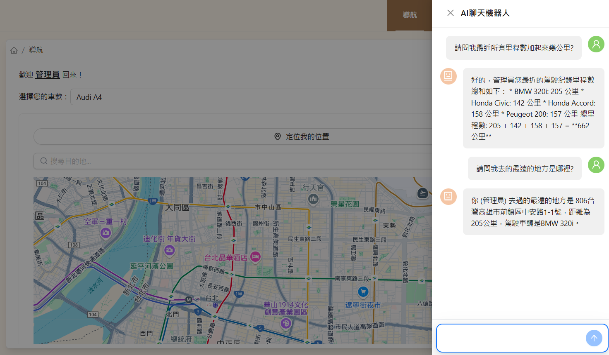
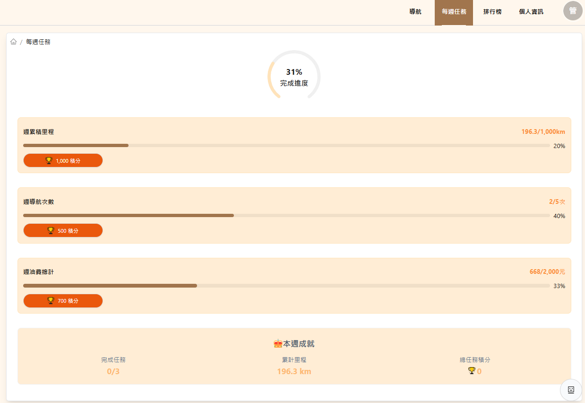
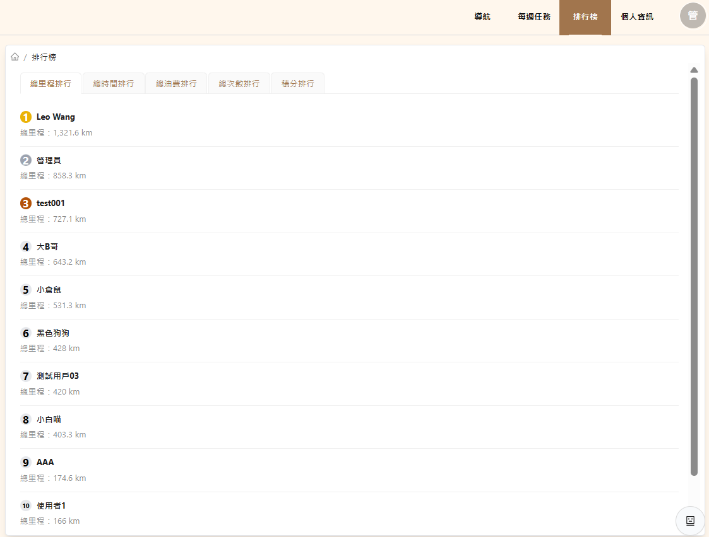
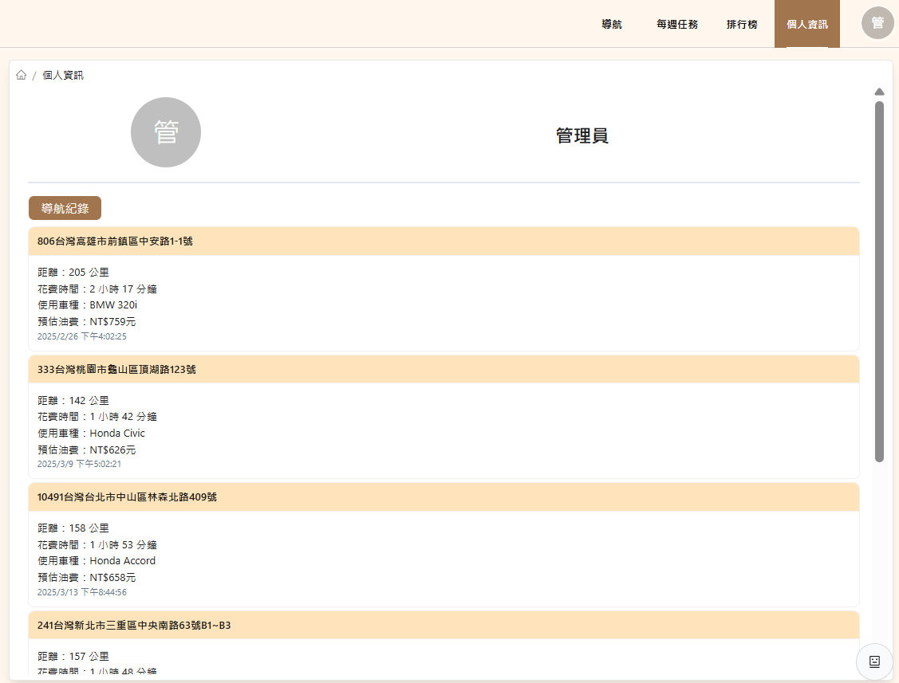
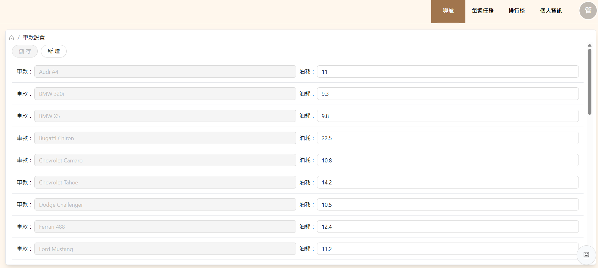

# 導航紀錄系統

這是一個基於 React、TypeScript 和 Vite 構建的現代化前端應用程式，組合導航功能與個人任務管理，幫助使用者記錄導航活動、追蹤目標並與其他使用者競爭。專案整合了 Google Map API 和 Gemini AI 聊天機器人，使用 Firebase 作為後端資料庫，提供流暢的使用體驗。

## 功能特色

<ul>
  <li>註冊與登入系統：使用者可透過安全的帳戶系統儲存個人資料並啟用個人化功能。</li>
  <li>Google Map API 導航：提供即時路線規劃與導航功能。</li>
  <li>導航記錄：自動記錄每次導航的里程、距離、時間與次數，方便分析與回顧。</li>
  <li>個人每週任務：設定並管理週目標，幫助使用者保持動力並追蹤進度。</li>
  <li>使用者排行榜：支援里程、距離、時間、次數與週積分排行，增強競爭樂趣。</li>
  <li>Gemini AI 聊天機器人：提供智慧對話，解答問題並給予導航建議。</li>
  <li>車款管理與油耗更新：管理者可設定車款並更新油耗數據，確保記錄的準確性。</li>
  <li>RWD 響應式設計：支援不同裝置，確保良好的使用體驗。</li>
</ul>

## 使用技術

<ul>
  <li>React + TypeScript：提供高效且穩定的前端架構。</li>
  <li>Vite：加速開發並支援熱模組替換 (HMR)。</li>
  <li>Firebase：即時同步使用者資料、導航記錄與任務資訊。</li>
  <li>狀態管理：利用 Redux Toolkit 確保資料流的可預測性。</li>
  <li>樣式：採用 Tailwind CSS 搭配Ant Design提供靈活且高效的 UI 設計。</li>
</ul>

### 頁面示例

